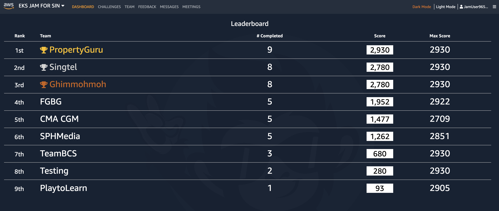

# aws-eks-jam

## Dashboard


## Challenges
https://jam.awsevents.com/149cc6c3-82f0-4eb9-a9e0-b762d976d32e/challenges 


### Challenge: AMAZON EKS CLUSTER CREATION USING TERRAFORM
https://jam.awsevents.com/149cc6c3-82f0-4eb9-a9e0-b762d976d32e/challenges/eks-jam-clusterdeploy-001 
#### Addiitional Resources
Outputs:
cluster_endpoint = "https://C09A4ED2D22EC7A24B63BD0CCD0FCE06.gr7.us-west-2.eks.amazonaws.com"
cluster_name = "eks-jam-challenge-1"
cluster_security_group_id = "sg-0e602357f19c0d2bf"

Update kubeconfig to access the cluster
```
aws eks update-kubeconfig --name eks-jam-challenge-1 --region us-west-2
```

Get the iam mapping for the Kubernetes cluster
```
eksctl get iamidentitymapping --cluster eks-jam-challenge-1 --region=us-west-2
```

Add iam identity mapping to the Kubernetes cluster 
```
eksctl create iamidentitymapping --cluster eks-jam-challenge-1  --region=us-west-2 \
    --arn arn:aws:iam::387519492768:role/AWSLabsUser-eHCwcXSLjUyJxRPMVsUVHi --username admin --group system:masters \
    --no-duplicate-arns
```
### Challenge: CREATE AN EKS CLUSTER USING AWS CDK EKS BLUEPRINTS
Amazon EKS Blueprints Quick Start
https://aws-quickstart.github.io/cdk-eks-blueprints/getting-started/ 


### Challenge: SCALING USING KARPENTER
https://jam.awsevents.com/149cc6c3-82f0-4eb9-a9e0-b762d976d32e/challenges/eks-jam-resiliency-004?i=1&t=details-1 

### Challenge: MAKING APPLICATIONS ACCESSIBLE AND RESILIENT IN AMAZON EKS
https://jam.awsevents.com/149cc6c3-82f0-4eb9-a9e0-b762d976d32e/challenges/eks-jam-resiliency-001

### Challenge: CLUSTER CREATION USING CLI TOOL EKSCTL
https://jam.awsevents.com/149cc6c3-82f0-4eb9-a9e0-b762d976d32e/challenges/eks-jam-clusterdeploy-002

aws eks update-cluster-config \
    --region eu-west-1 \
    --name eks-jam \
    --logging '{"clusterLogging":[{"types":["api","audit","authenticator","controllerManager","scheduler"],"enabled":true}]}'

### Challenge: EKS OBSERVABILITY
https://jam.awsevents.com/149cc6c3-82f0-4eb9-a9e0-b762d976d32e/challenges/eks-jam-o-11-y-001?i=3&t=details-3

#### Deploy a sample application to test the AWS Distro for OpenTelemetry Collector
https://docs.aws.amazon.com/eks/latest/userguide/sample-app.html

